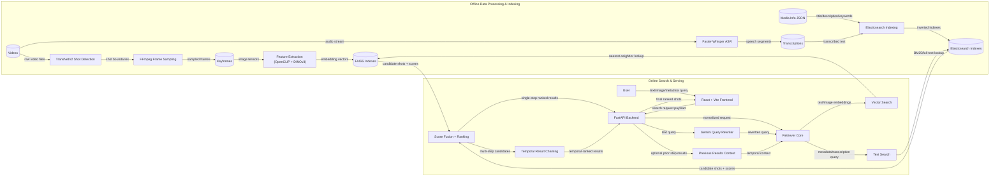

# Event Retrieval System

This repository implements a multimodal video event retrieval system that indexes shot-level keyframes and text metadata/transcriptions, then retrieves relevant video moments from text, image, transcription, or metadata queries using vector search and full-text search. It also supports temporal search by chaining continuously provided queries across steps. Especially, this system is used for the preliminary round of the [HCMC AI Challenge 2025](https://aichallenge.hochiminhcity.gov.vn/).

## Technology Stack

| Technology | Purpose |
|---|---|
| Python 3.11 | Primary backend and ML pipeline language |
| FastAPI + Pydantic | API server and request/response schema validation |
| PyTorch + TorchVision + [OpenCLIP](https://github.com/mlfoundations/open_clip) | Visual feature extraction and multimodal embedding models |
| Hugging Face Transformers ([DINOv3](https://huggingface.co/collections/facebook/dinov3)) | Deep visual feature extraction for image-based retrieval |
| [FAISS](https://github.com/facebookresearch/faiss) | Vector similarity indexing and nearest-neighbor search |
| [Elasticsearch](https://github.com/elastic/elasticsearch-py) | Full-text indexing and retrieval for metadata and transcriptions |
| [Faster Whisper](https://github.com/SYSTRAN/faster-whisper) | Speech-to-text transcription pipeline |
| FFmpeg | Video decoding, frame extraction, and preprocessing |
| [TransNetV2](https://github.com/soCzech/TransNetV2) | Shot boundary detection for video segmentation |
| [Google Gemini API](https://aistudio.google.com/api-keys) | Query rewriting support |
| React 19 + Vite | Frontend application and development tooling |
| Node.js + npm | Frontend package/runtime ecosystem |
| Micromamba | Environment and system dependency management |

Note: `DINOv3` is a gated model that requires a Hugging Face account with access permissions. You will need to log in to Hugging Face on the command line and ensure you have access to download the model weights.

## Key Features

- Multimodal retrieval with text, image, transcription, and metadata queries.
- Shot-level keyframe indexing for precise video moment discovery.
- Hybrid search combining vector similarity (FAISS) and full-text retrieval (Elasticsearch).
- Query rewriting support using Gemini to improve text-query expressiveness.
- Weighted result fusion across modalities with configurable pooling and ranking.
- Temporal search over continuous query sequences for multi-step event refinement.
- End-to-end pipeline for shot detection, frame sampling, feature extraction, and indexing.

## System Architecture



**How to read this diagram:** The top flow prepares searchable data in advance (offline), while the bottom flow handles live user search (online). Arrow labels show what data is passed between steps.

## Setup Instructions

### Backend

- Create a Python virtual environment and activate it:
```bash
micromamba create -n event-retrieval python=3.11
micromamba activate event-retrieval
```

- Install Python dependencies:
```bash
pip install torch torchvision torchaudio \
    --index-url https://download.pytorch.org/whl/cu126
pip install matplotlib tensorflow ffmpeg-python pillow \
    ftfy regex tqdm "fastapi[standard]" open_clip_torch \
    google-genai python-dotenv accelerate elasticsearch \
    faster-whisper ctranslate2==4.6.0 transformers
micromamba install ffmpeg
micromamba install -c pytorch faiss-cpu
GIT_LFS_SKIP_SMUDGE=1 pip install git+https://github.com/soCzech/TransNetV2.git
```

- Download pre-trained model weights for `TransNetV2`:
```bash
python backend/download-weights.py
```

- Set up Elasticsearch (requires Docker):
```bash
curl -fsSL https://elastic.co/start-local | sh -s -- --esonly
```
After running the above command, the local API key will be printed in the terminal. You can also find it in [this file](elastic-start-local/.env) after the setup is complete.

- Create a `.env` file in the `backend` directory and add your secret keys:
```
GEMINI_API_KEY=your_api_key_here
ES_LOCAL_API_KEY=your_api_key_here
```

### Frontend

- Install Node.js dependencies:
```bash
cd frontend
npm install
```

## Configuration Guide

Use `backend/src/configs.py` as the single source of truth for data paths, model choices, and search/index settings.

- **Data locations**: `VIDEO_DIR`, `OUT_FRAME_DIR`, `VIDEO_METADATA_PATH`, `FRAME_DATA_PATH`, `MEDIA_INFO_DIR`, `WHISPER_OUTPUT_PATH`
- **Model settings**: `CLIP_MODEL`, `CLIP_PRETRAINED`, `DINO_MODEL`, `CLIP_MODELS`, `DEFAULT_CLIP_MODEL`
- **Generated artifacts**: `CLIP_VECTOR_DATA_PATH`, `DINO_VECTOR_DATA_PATH`, `DINO_INDEX_SAVE_PATH`
- **Search backend**: `ELASTIC_HOST`, `MEDIA_INFO_INDEX_NAME`, `TRANSCRIPTION_INDEX_NAME`, `DOT_ENV_FILE`
- **Static API paths**: `STATIC_IMAGE_PATH`, `STATIC_VIDEO_PATH`

When changing configs, use this checklist:

1. Edit values in `backend/src/configs.py`.
2. If you changed data/model-related fields, regenerate artifacts:
    - `python backend/src/sample.py`
    - `python backend/src/extract.py`
    - `python backend/src/index.py`
3. Restart backend/frontend services so new settings are loaded.

Tip: keep path-related variables consistent under `DATA_ROOT_DIR` to avoid broken file references.

## Usage

### Data Preparation

Organize your data as follows:

- `data/videos/`: Place your raw video files here. The offline pipeline will read from this directory to process videos.
- `data/media-info/`: Place JSON files containing media information (title, description, keywords, etc.) here. These will be indexed in Elasticsearch for metadata search.

The data used for the preliminary round of the HCMC AI Challenge 2025 can be found [here](https://huggingface.co/datasets/leducthanhig/hcmc-aic-2025).

### Prepare searchable data

Run the offline pipeline in order:

```bash
python backend/src/sample.py
python backend/src/extract.py
python backend/src/index.py     # start Elasticsearch before this step
```

### Start services

- Start Elasticsearch:
```bash
elastic-start-local/start.sh
```

- Start backend API server:
```bash
fastapi dev backend/src/app.py
```

- Start frontend React application:
```bash
npm run dev --prefix frontend
```

### Search in the web UI

Open the frontend URL shown by Vite (typically `http://localhost:5173`) and submit queries in any supported mode:

- Text query
- Image query
- Transcription query
- Metadata query

### Temporal search (continuous queries)

Temporal search is supported by chaining results across steps.

- Run an initial query.
- Keep the returned results as context.
- Submit the next query with previous-step results so ranking is refined over time.

In the backend API, this context is passed through the `previous_results` field of the search request.
